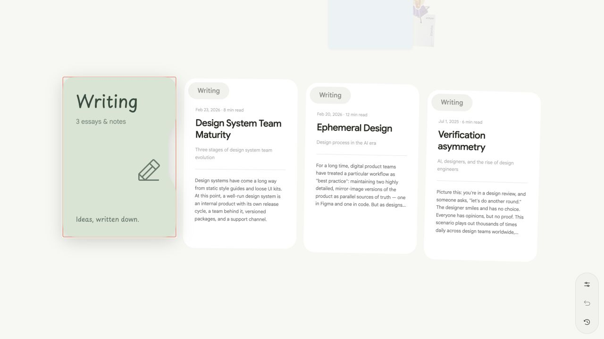

# Writing integration

Blog content from `rickyzhangca/blog` at `e6b19d844d9eb73e3caa0d6e15116489630061cd` now lives in this repository. The three essays and six translations retain their text, diagrams, reviewer credits and publication dates. Only framework imports and asset references changed; SVG attribute order was normalized by Biome.

## User experience

Writing is a canvas folder below the existing document cards. One paper card represents each essay, with its title, date, reading time and a continuous opening preview. Paragraphs and heading levels flow to the edge of the paper, where a bottom fade clips overflow without ellipses or a fixed line clamp. Cards and article headers have no cover illustrations; articles have no automatic table of contents or More writing footer. The folder uses existing fan controls and drag behavior. It mounts two inert previews while collapsed and at most six cards per expanded page; folders with more essays get previous/next controls.

Opening an essay updates its URL and displays the shared accessible reader. Resume and About also use this reader shell. Article language changes and section links replace the current history entry; closing returns to the canvas in one step, restoring its expanded folder, position and focus. Background pointer and keyboard handlers remain locked while reading or when the persistent canvas is hidden.

Paper cards and readers share an instance-specific Motion layout ID inside the canvas LayoutGroup. AnimatePresence keeps the dialog and content alive through the spring return to the source card; the bottom controls animate in and out. As soon as exit starts, the retained dialog becomes inert and releases pointer interception and modal isolation, allowing another card to open without waiting for the animation. Its portal is excluded from canvas outside-click collapse detection, and exiting controls cannot request another close. The article overlay belongs to the persistent canvas rather than the route, so changing the URL cannot interrupt closing. Its projection frame retains the card's proportions while long content flows into the scroll viewport. The scroll viewport receives focus on opening, including reopening during exit, to keep the opening at the top and support keyboard scrolling. Focus returns to the article card after the exit completes unless another article has opened, and repeated closing during exit cannot pop another history entry.

ArticlePaper supplies the same responsive paper width, padding, header and article-prose typography to the reader and its preview. ReaderPaperLayout measures available width once with the reader's reserved scrollbar gutter; preview observers track untransformed dimensions independently of canvas zoom. Cards lay out this paper at reading width before scaling it as a whole. Article projections retain their aspect ratio at the actual available width, clip the long body during layout motion and release overflow on arrival. The reserved gutter prevents scrolling or clipping from changing width and restarting the transition on small screens. Rounded corners participate in the shared layout transition. The session remembers each article's selected language so closing and reopening use the same translated card.

The transformed canvas wrapper uses `overflow: clip`, avoiding the hidden-container scroll that browsers otherwise introduce when keyboard focus moves to an offscreen card. Canvas positioning remains controlled by its transform and auto-pan.

Direct requests to `/writing/en/<slug>` or `/writing/cn/<slug>` receive complete static HTML. These pages do not mount or load the canvas, and their return link points to the portfolio. The retired `/writing` index has no route, static output or sitemap entry. Refreshing an overlay URL produces the standalone article page.

## Adding an essay

Create `src/content/articles/<lowercase-kebab-slug>/meta.json` and one or both language files (`en.mdx`, `cn.mdx`):

```json
{
  "published": "2026-09-30",
  "title": { "en": "Essay title", "cn": "文章标题" },
  "description": { "en": "A short description.", "cn": "简短介绍。" },
  "draft": false
}
```

Only declare a language when its MDX file exists. A Chinese-only essay opens in Chinese. Use h2–h6 in the body; the reader provides the h1. GFM tables, lists, blockquotes, inline code and Unicode headings are supported. Section IDs and duplicate-heading suffixes come from the same slugging algorithm used by the rendered MDX.

For local images, put files under the essay's `assets/` directory and use static imports:

```mdx
import { ArticleImage } from "@/components/articles/article-image";
import diagram from "./assets/diagram.svg";

An introductory paragraph.

## A section

<ArticleImage src={diagram} alt="Describe the diagram" width={1000} height={600} />
```

Supply meaningful alt text and the image's original dimensions. Static imports produce hashed deployment URLs. An optional `export const credit = <... />` renders a credit footer. MDX is trusted repository source and is compiled during the build.

`pnpm dev` validates content before starting and watches additions, deletions and edits. `pnpm content:generate` regenerates the catalogue, loaders, share images and sitemap. Share images refresh on content generation/build rather than each dev edit. `pnpm build` validates and prerenders every published translation automatically. Never edit `src/content/generated` or generated public files.

Drafts are excluded from browser manifests, cards, prerender paths, sitemap and share images. Generation also removes stale share images. Invalid metadata, dates, missing declared translations, h1s and missing imported assets fail the build with a file-specific error. Draft sources are still validated.

## Architecture and performance

- React Router Framework Mode owns URLs and static prerendering (`ssr: false`); no production application server is required.
- The root loads the canvas through a client-only lazy boundary and preserves that instance during navigation. History state stores only the source item/card identity.
- The catalogue contains metadata and bounded previews. Heading metadata remains in Node tooling for HTML validation and is omitted from the client catalogue. A separate explicit import manifest contains only published MDX modules; one slug/locale loads at a time and shares its in-flight promise. Client navigation awaits this module in clientLoader and renders its resolved value immediately, avoiding a Suspense loading flash during projection; the server loader prepares static rendering independently.
- Article previews retain a static prefix with inline formatting, headings, separators, lists and quotes, capped at 16 blocks, 4,000 Unicode characters, 256 nodes and 12 nesting levels. Unsupported MDX/media stops the prefix instead of rearranging visible content; imports are excluded. A fade ends at the clipped card edge or the available prefix, whichever comes first. Previews never load full MDX or article images. The only article observer tracks paper scale; generic card height measurement remains disabled.
- An open article overrides the expanded folder as the repulsion source. Its center uses the same visible-page fan placements as rendering, including rotation around the top-left corner and vertical arcs. Background items, the cover and sibling articles move from that center; the active source stays fixed for shared-layout motion. Independent spring wrappers keep repulsion separate from folder/reader animations and restore the page on close.
- `getStackPage` and `getExpandedStackLayout` are shared by drawing and auto-pan. Bounds account for rotation about the actual top-left origin.
- ReaderShell uses Base UI Dialog for focus trapping and closing, plus reduced-motion-aware animation. Gesture suppression belongs to the canvas, while article content scrolls and remains selectable.
- The broad vendor matcher was removed; Markdown/Shiki resources are split from the main graph. Existing About previews still use their lazy Markdown renderer.
- The OFL-licensed Noto Sans SC font in `tools/fonts` makes Chinese/English OG generation deterministic without network access or platform fonts. Its full character coverage supports future essays. It is a build dependency and is never served.

## Validation

`pnpm build` includes an artifact check for all six article HTML files: one h1, rendered body, language, canonical URL, every section ID, local assets, sitemap membership, 1200×630 sharing PNGs and static 404 output.

Automated tests cover content validation and draft exclusion, nested card identity, locale fallback, drag/modifier navigation, accessible closing, retained canvas sessions, direct routes and 404s. Fixtures with 3, 100 and 1000 cards verify bounded layout work; a rendered 1000-card folder verifies the actual two/six-card DOM limits. Coverage thresholds remain unchanged.

The integration passes 260 tests across 34 files. Changed source files pass Biome; the repository-wide check still reports pre-existing diagnostics in untouched files. Continuous preview generation, Unicode bounds, rotated/paged document repulsion, fixed source anchors, exit retention, repeated close actions and the retired index route are covered by content, canvas, reader and route regression tests; actual shared-layout motion is verified in a browser.

Browser checks cover desktop folder expansion, article opening, English/Chinese switching, Escape, Back/Forward, focus restoration, independent article refresh, mobile reading and diagram loading. Observed home assets contain no article body modules; independent article assets contain no canvas app or project images. Large optional Shiki grammar/WASM chunks still produce a build warning; they are not requested in these page flows. No runtime frame-rate or production Core Web Vitals claim is made.



## Deployment and old URLs

Deploy `dist/client` using the included Vercel configuration. The build flattens Router's generated directory-index HTML to clean-URL HTML files so preview and hosting use the same documents. Static HTML and OG images revalidate; hashed assets cache immutably. Vercel serves the generated `404.html` for unmatched static routes, as described in its [custom 404 documentation](https://vercel.com/kb/guide/custom-404-page). The Vite preview server's fallback is not a production HTTP-status test.

This implementation has not been deployed, and the old blog deployment remains intact. After deploying and verifying production status codes, caching and hydration, configure permanent redirects at the actual old blog host:

| Old path | New destination |
| --- | --- |
| `/en/<slug>` | `https://rickyzhang.me/writing/en/<slug>` |
| `/cn/<slug>` | `https://rickyzhang.me/writing/cn/<slug>` |
| `/<slug>` | `https://rickyzhang.me/writing/en/<slug>` |
| `/`, `/en`, `/cn` | `https://rickyzhang.me/` |

Preserve query strings and verify fragment behavior against the old heading IDs. The old Chinese slugger discarded Chinese characters, so previously published Chinese fragment links may require explicit legacy aliases. Do not retire the old site until redirects and shared links are checked. Portfolio becomes the single writing source after this cutover.
